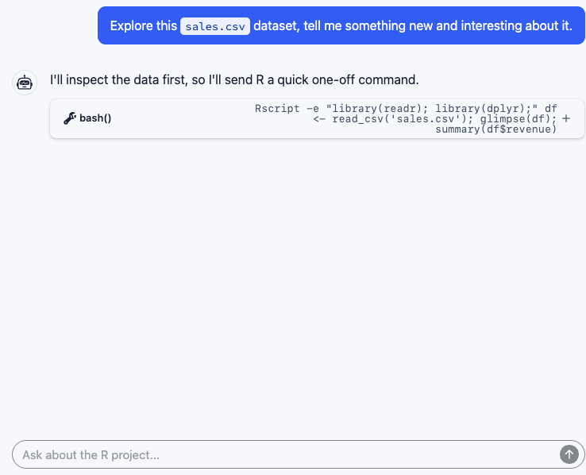
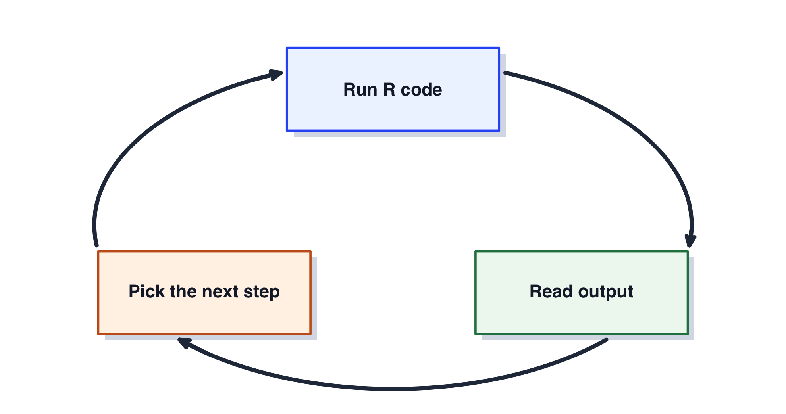
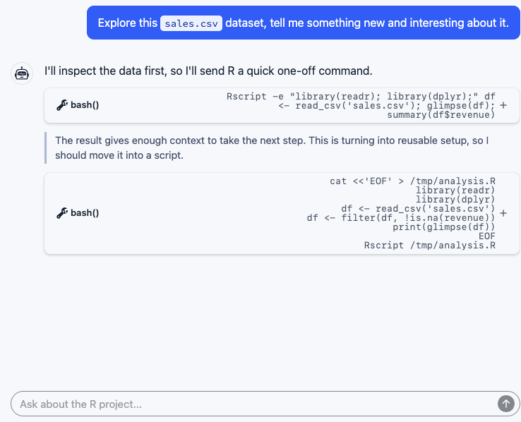
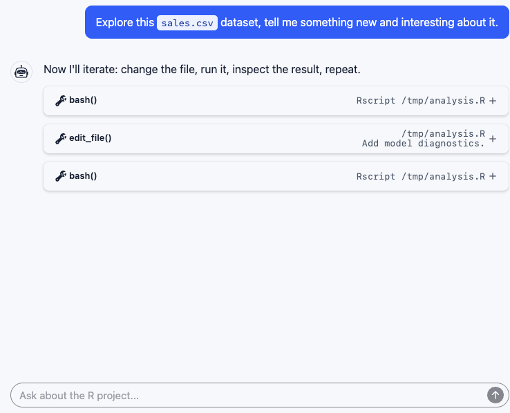
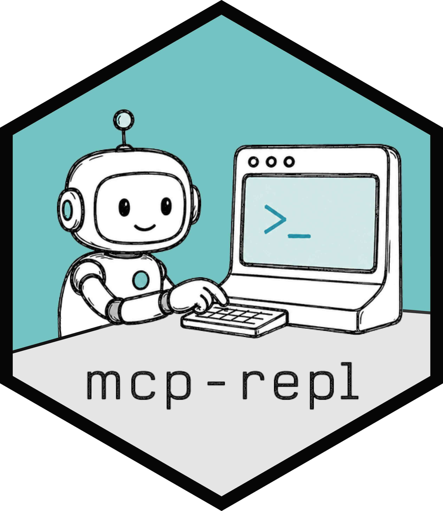
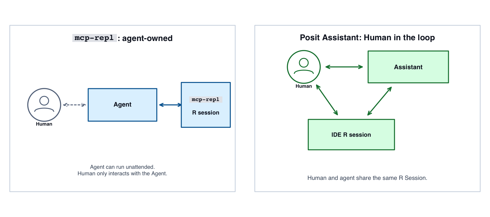

## For agents, the standard interface to R is `Rscript` {.intro-chat-slide}


{
  fig-alt="A chat interface where the assistant uses a Bash tool call to
run an Rscript -e command that loads packages, reads sales data, filters
missing revenue, and prints summaries."
}


## Real work requires multiple turns




## Each turn is a new R session {.intro-chat-slide}


{
  fig-alt="A chat interface where the assistant first uses an inline
Rscript bash tool call, then shows a short reasoning summary, then uses
another bash tool call to write and run a temporary R script."
}


## Each turn is multiple tool calls {.intro-chat-slide}


{
  fig-alt="A chat interface where the assistant runs a temporary R
script, edits the script to add model diagnostics, and reruns it."
}


## Using R through a shell tool

- The shell tool is available, so the agent uses it.
- Each turn, the R process starts from zero.
- Setup expressions repeat and compound, <br> wasting time, compute, and
  tokens.
- The chat session has continuity, the R session does not.


## `mcp-repl`

The name combines two acronyms:


MCP : Model Context Protocol
: A standard way for an app to give a model tools


REPL : Read-Evaluate-Print loop
: An interactive language session


## `mcp-repl` {#what-mcp-repl-is .hex-logo-slide}

- An open-source stdio MCP server.
- A CLI binary built in Rust.
- Runs locally on your machine.
- Gives a live persistent runtime for an agent.
- Runs R or Python *in a sandbox*.




## A compact, token-efficient interface

```text
  repl({
     "input": "1 + 1",
     "timeout_ms": 10000
  })
```

- One compact tool that accepts input code.
- Capabilities live in the runtime, not a wide MCP surface.

## An interface designed for LLMs

```text
  repl({
     "input": "1 + 1",
     "timeout_ms": 10000
  })
```

Affordances for models:

- Help
- Plots
- Timeouts, interrupts, restarts
- Oversized outputs


## Runs a regular R or Python interpreter

- Uses the same R and Python installation as you.
- Uses the same package libraries as you.
- Works with any standard CRAN, Bioconductor, or PyPI package.


## Runs embedded R

- The main integration point is `R_ReadConsole`

- Unlike `eval(parse())`, it supports interactive modes:
  - debuggers: `browser()`, `recover()`, `pdb`
  - nested REPLs: `reticulate::repl_python()`, IPython
  - continuations and incomplete expressions
  - any interaction built on `readline()` or `input()`

- Unlike a PTY manager, it knows precisely when the runtime is ready
  for more input. No heuristics based on output or timing.


## Sandbox model

- Broad runtime capabilities come with the risk of enormous harm.
- The sandbox is built with OS primitives <br> (macOS, Linux, Windows)
  - Not an LLM prompt
  - Not a tool call filter
- Sandbox policy applies to the runtime process and all spawned child processes.


## Default Sandbox Policy: <br> `workspace-write`

- No network access
- Filesystem edits restricted to the project directory,<br>
  `tempdir()` and common cache locations <br>
  (except `.git/`, `.agents/`, `.claude/`, `.codex/`)
- Most kernel and system calls are restricted
  - Narrow practical carveouts tailored for R code <br> (e.g., `parallel::detectCores()`)


## Optional sandbox policies

- `read-only`: no filesystem edits except `tempdir()`
- Additional writable roots
- Limited network access allowances via embedded proxy
- Read restrictions


## Runs R with guardrails

- Runtimes with runaway memory consumption are killed before they run
  out of memory.
- On exit, `tempdir()` and spawned processes are cleaned up.
- A fresh session is automatically restarted
  - The REPL is always available

<!--
## An interface designed for LLMs

```text
  repl({
     "input": "1 + 1",
     "timeout_ms": 10000
  })
```
- Help
- Plots
- Timeouts, interrupts, restarts
- Oversized outputs


## Timeouts

- `timeout_ms` is a response deadline.
  - A long timeout lets the model wait on a long-running command without
    context-wasting polling. MCP tool calls typically block.
  - A short timeout lets the model run a computation in the background while
    it does other things.
- Empty `input` polls pending output or idle status.


## Interrupts, resets, cleanup

- `^C` sends an interrupt
- `^D` restarts the session.
  - First a graceful shutdown request, then forceful termination with cleanup.
- A session is always available:
  - Segfaults and other hard crashes simply result in a new session after cleanup.


## Output designed for models

- Plots shown as images (for image-capable models)
  - plot updates are collapsed within a turn (e.g., `plot(); lines(); points()`)
  - plot updates work across turns
- Echo not shown for most inputs (the model already knows what it sent)
  - Truncated echo shown only if necessary to support attribution.
- `help()`, `?`, `vignette()`, `browseURL()` return Markdown-formatted output


## Output designed for efficient use of model context

- To avoid flooding the model context, output from a single turn is capped at
  ~1600 tokens and 2 images
- Oversized bundles spill over into a pager or filesystem bundle
  - filesystem bundle: the default
  - pager: for when the model is not given filesystem capabilities
 -->


## Two useful shapes

{width="100%" fig-alt="Diagram comparing an agent-owned mcp-repl R session with a human-in-the-loop Posit Assistant IDE R session."}


## Takeaways {#takeaway .takeaway-slide}


<br>
Use `mcp-repl` to give an LLM agent:

  - A real R or Python session
  - A sandboxed runtime designed for agents
  - A compact, token-efficient, full-featured workbench


<https://github.com/posit-dev/mcp-repl>

```sh
uv tool install posit-mcp-repl
mcp-repl install --client codex --interpreter r
```


